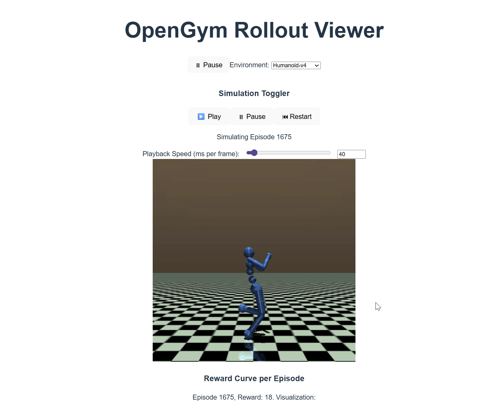

# 🧠 OpenGym Copilot

**OpenGym Copilot** is a real-time visualizer and debug tool for OpenAI Gym environments. It lets you stream agent rollouts live from a backend, visualize frame-by-frame behavior, and inspect episodic outcomes — all through a clean, interactive frontend.

> 🚀 Reinforcement learning visualization shouldn't be guesswork.

---

## 🎯 Features

- 🔁 **Real-time environment rollout streaming** over WebSocket
- 🖼 **Episode frame playback** with looped simulation in-browser
- 🎛 **Adjustable frame capture interval** (e.g., every N episodes)
- 📦 **Environment selector** (e.g., `CartPole-v1`, `MountainCar-v0`)
- 🧠 **Built for easy Copilot & training integration (coming soon)**

---

## 🖥 Demo Preview

https://user-demo-link-if-applicable



---

## 🛠 Tech Stack

- **Frontend**: React + Vite + WebSocket
- **Backend**: FastAPI + Gymnasium
- **Visualization**: JPEG frame streaming + canvas rendering (future: Three.js)
- **Agent**: Random policy for now (training coming soon)

---

## 🚀 Getting Started

### 🔧 Backend (Python + FastAPI)

```bash
pip install fastapi uvicorn gymnasium opencv-python
uvicorn main:app --reload
```
### 🔧 Frontend (npm + ReACT)
```bash
npm install
npm run dev
```
