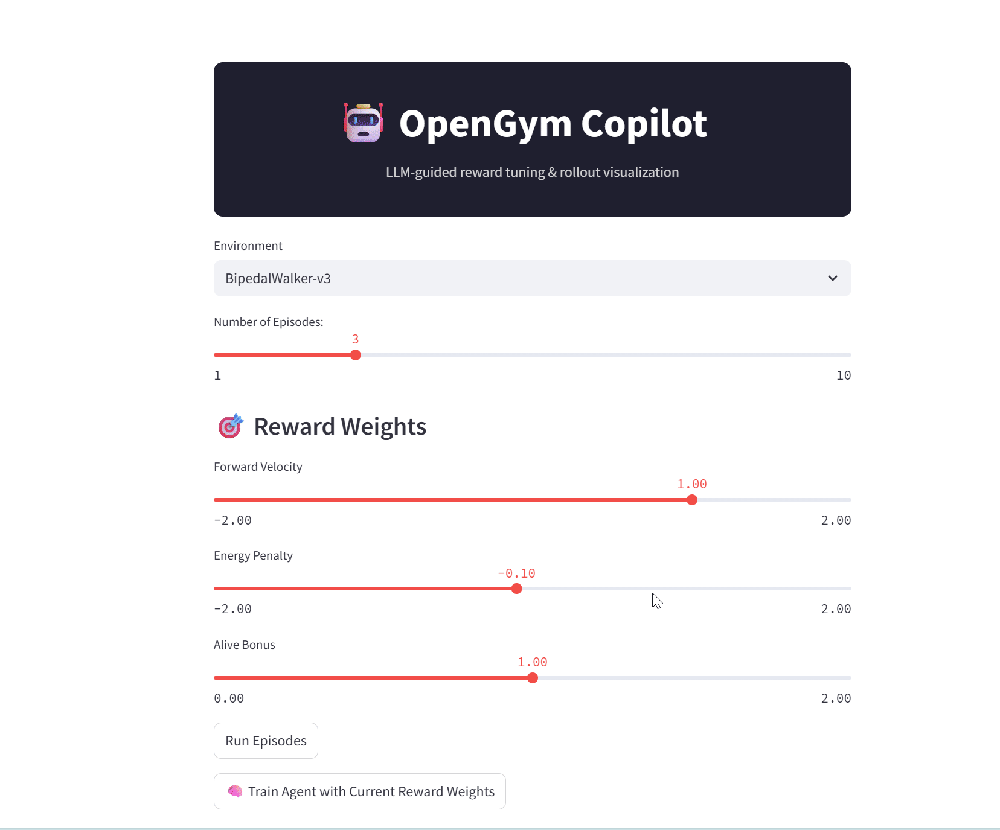

# 🤖 OpenGym Copilot

**LLM-Guided Reward Tuning & Rollout Visualization for Reinforcement Learning**

## Check out the demo!



---

## 🔥 Why OpenGym Copilot?

Designing reward functions is one of the hardest parts of RL. **OpenGym Copilot** is a live, visual, and LLM-augmented tool to:

- ✅ Test and tweak reward shaping interactively
- ✅ Visualize rollouts frame-by-frame
- ✅ Save episodes to MP4 or GIF
- ✅ Debug Gym environments without writing training loops
- ✅ Use natural language to eventually guide reward tuning (WIP)

---

## 🧠 What It Does

| Feature | Description |
|--------|-------------|
| 🎮 Gym Support | Works with `Pendulum`, `BipedalWalker`, `LunarLander`, and `MuJoCo v4` |
| 🖼️ Rollout Viewer | Frame-by-frame and auto-playback visualization |
| 🧩 Reward Editor | Tune reward components via sliders |
| 💾 Episode Saving | Export episodes as `.mp4` or `.gif` |
| 🦾 LLM Copilot (coming soon) | GPT-style suggestions for better shaping |

---

## 🚀 Quickstart

### 1. Clone the Repo

```bash
git clone https://github.com/zhenga1/opengym-copilot.git
cd opengym-copilot
