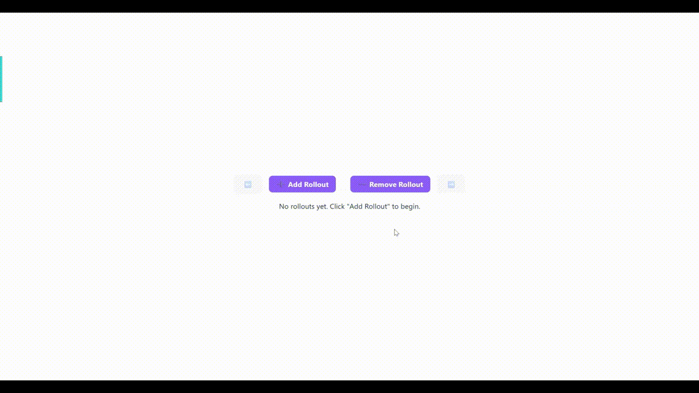

# OpenGym Copilot

OpenGym Copilot is a realtime Gymnasium environment viewer for RL experimentation. It separates training from rollout playback, exposes reward shaping controls in the UI, and lets you inspect reward terms while agents are learning.

The project is aimed at a workflow where you can:
- train a policy
- watch rollouts live
- tune reward terms without rewriting the environment
- compare saved rollout sessions afterward

## Current Features

- Live rollout streaming over WebSocket from the FastAPI backend
- Separate `Training Workspace` and `Rollout Workspace` in each viewer
- Reward shaping wrapper around Gymnasium environments
- Editable reward weights from the frontend sidebar
- Reward breakdown logging for rollout episodes and training episodes
- Environment-specific reward templates for classic control, Box2D, and MuJoCo envs
- Saved rollout export to `{cwd}/rollouts/*.json`
- Saved rollout loading into a new read-only rollout viewer window
- Live model upload and model selection for rollout playback
- Random rollout policy by default unless a model is explicitly loaded
- Clean stop-training flow through the backend callback path
- Training progress polling and live training ticks
- Training graph term selector and rollout graph term selector
- Per-term reward plots for both training and rollout
- Training hyperparameter popup before training starts

## Reward Tuning

The backend no longer treats reward as one opaque scalar. Rewards are wrapped and split into named terms such as:

- `native`
- survival bonuses
- position penalties
- angle penalties
- control penalties
- task-specific shaping terms

Those terms are:
- logged separately
- rendered in the reward sidebar
- editable through reward weights in the frontend
- applied to both rollout and training environments

Reward configuration is stored per `run_id`, so different rollout windows can use different reward settings.

## Training Controls

Starting training opens a popup that lets you configure:

- training output filename inside the managed `models/` storage
- device (`cpu` or `cuda`)
- learning rate
- learning rate schedule
  - `constant`
  - `linear`
  - `cosine`
- PPO hyperparameters such as:
  - `n_steps`
  - `batch_size`
  - `n_epochs`
  - `gamma`
  - `gae_lambda`
  - `clip_range`
  - `ent_coef`
  - `vf_coef`
  - `max_grad_norm`
- model size
  - `small`
  - `medium`
  - `large`

These values are sent to the backend and used when constructing the PPO model.

## Visualization

### Training Graphs

The training viewer can display:

- `eval_reward`
- `reward_mean`
- latest episodic `reward`
- reward breakdown totals
- individual reward breakdown terms

You can switch between training metrics with:

- the `<` and `>` graph navigation buttons
- the graph dropdown beside the plot

The training graph keeps full history and compresses into a fixed-width chart instead of discarding old points.

### Rollout Graphs

The rollout viewer can display:

- total rollout reward
- breakdown totals
- native reward
- per-term shaped reward values
- per-term raw reward values when available

Rollout graphs also support:

- `<` and `>` graph navigation
- direct graph selection from the dropdown

## Saved Rollouts

Rollouts can be saved from the frontend and written to:

```text
{cwd}/rollouts
```

Saved rollout JSON files can be loaded back into the app. Loading a saved rollout opens a new viewer window instead of overwriting the current live rollout.

## Tech Stack

- Frontend: React + Vite + Chart.js
- Backend: FastAPI + Gymnasium
- RL: Stable-Baselines3 PPO
- Visualization: WebSocket event streaming + browser-side charting and frame playback

## Getting Started

### Backend

Create an environment with the required Python packages, then start FastAPI:

```bash
pip install -r requirements.txt
uvicorn main:app --reload --host 0.0.0.0 --port 8000
```

### Frontend

```bash
cd opengym-frontend
npm install
npm run dev
```

The dev frontend uses the Vite proxy, so HTTP requests and WebSocket traffic still land on the FastAPI backend at `localhost:8000`.

## Production Website Deployment

This app cannot be deployed as GitHub Pages alone because training, uploads, saved rollouts, and WebSocket streaming all require a live Python backend. The workable path is:

1. Push this repo to GitHub.
2. Deploy the repo to a container host such as Render, Railway, Fly.io, or a VM.
3. Let FastAPI serve the built React frontend and the API from the same origin.

### Render via GitHub

This repo now includes:

- `Dockerfile` for a single-container production build
- `render.yaml` for a Render web service with a persistent disk
- `requirements.txt` for the Python backend

Steps:

1. Create a new GitHub repo and push this project.
2. In Render, choose `New +` -> `Blueprint` and point it at the GitHub repo.
3. Render will detect `render.yaml`, build the Docker image, and deploy the app.
4. Open the generated `https://...onrender.com` URL and the React app should load from the FastAPI server.

The official demo is at the following link: `https://opengym-copilot.onrender.com/`. 

### Local Production-Style Run

Build the frontend once:

```bash
cd opengym-frontend
npm install
npm run build
```

Then run only the backend from the repo root:

```bash
uvicorn main:app --host 0.0.0.0 --port 8000
```

FastAPI will serve:

- the API endpoints
- the WebSocket endpoint at `/ws/rollout`
- the built frontend at `/`

### Environment Variables

- `OPEN_GYM_DATA_DIR`: storage root for `models/`, `rollouts/`, and `progress_bar.log`
- `CORS_ALLOW_ORIGINS`: comma-separated origins for split frontend/backend deployments
- `VITE_API_BASE_URL`: optional frontend override for API base URL
- `VITE_WS_BASE_URL`: optional frontend override for WebSocket base URL
- `VITE_DEV_BACKEND_URL`: optional Vite dev proxy target

### Operational Notes

- Public hosting is practical for lighter CPU environments first. MuJoCo and large multi-user training loads will want a stronger host, and often a GPU-backed machine.
- Render starter instances sleep when idle and are not a good fit for serious training throughput.
- Model files and saved rollouts are now constrained to the app-managed storage directories, which is necessary for an internet-facing deployment.

## Demo



## Notes

- Training preview and rollout playback are intentionally separated in the backend.
- Rollout playback stays random by default until a model is explicitly loaded.
- Reward shaping support depends on the environment templates defined in `train_backend_reward_tuning/`.
